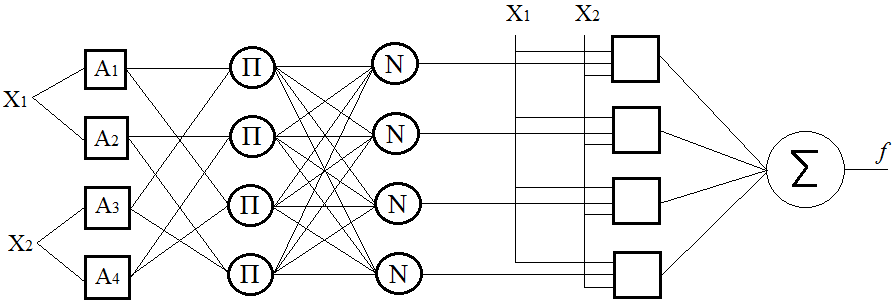
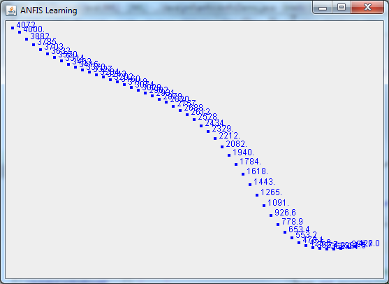

# Java Machine Learning Library

JML is an open-source Java library created by Jamal Hasanov in 2017, provides API and interfaces to design, train and run ANFIS networks. This Library allows you to:
- Design ANFIS network using Java code or configuration file;
- load training data from file;
- train ANFIS using hybrid learning algorithm;
- visualize the training process and results;
- Saved trained ANFIS structure with parameters;
- test ANFIS using Java code.

Current version of the library is 2.1.08.17

## Getting Started

In current phase, JML supports only Sugeno-type ANFIS. It trains your network using hybrid learning algorithm. Limitations:
- Only Bell / Sigmoid activation functions supported;
- Only AND / OR rules supported.

Network is trained with Hybrid training rule (LSE for Linear parameters and batch mode gradient descent for MF parameters). In batch mode to find the optimal learning rate the one-dimentional optimization algorithm is used. 

### Installing

Distributive of the library is located in **/dist** folder. Use this library to design, train and test your network. There are two ways to configure the ANFIS network:

#### Configuration 

- with Java API;
- through configuration file.

To design a Sugeno-type Inference System in JML with 2 inputs, 4 activation nodes (with Bell and Sigmoid type Membership Functions for each input) and 4 “AND” rules with Java API will look like this:




```
import jml.anfis.*;

int inputCount = 2;
int activationCount = 4;
int ruleCount = 4;

Anfis anfis = new Anfis(inputCount,activationCount);

// setup activations
anfis.activationList = new Activation[activationCount];
anfis.activationList[0] = new Activation(0, Activation.MembershipFunc.SIGMOID);
anfis.activationList[1] = new Activation(0, Activation.MembershipFunc.BELL);
anfis.activationList[2] = new Activation(1, Activation.MembershipFunc.SIGMOID);
anfis.activationList[3] = new Activation(1, Activation.MembershipFunc.BELL);

// setup rules
anfis.ruleList = new Rule[ruleCount];
anfis.ruleList[0] = new Rule((new int[]{0, 2}), Rule.RuleOperation.AND);
anfis.ruleList[1] = new Rule((new int[]{1, 3}), Rule.RuleOperation.AND);
anfis.ruleList[2] = new Rule((new int[]{0, 3}), Rule.RuleOperation.AND);
anfis.ruleList[3] = new Rule((new int[]{1, 2}), Rule.RuleOperation.AND);

// here ANFIS generates the remaining nodes
anfis.init();
```

To build the same network with configuration file, create a XML file with below content:

```
<anfis>
  <structure inputs="2" activations="4" rules="4"></structure>
  <layer id="1" desc="ACTIVATION">
    <param id="1" MF="SIGMOID">
      <input id="1"></input>
    </param>
    <param id="2" MF="BELL">
      <input id="1"></input>
    </param>
    <param id="3" MF="SIGMOID">
      <input id="2"></input>
    </param>
    <param id="4" MF="BELL">
      <input id="2"></input>
    </param>
  </layer>
  <layer id="2" desc="RULE">
    <param id="1" ruleInputCnt="2" OPERATION="AND">
      <input id="1"></input>
      <input id="3"></input>
    </param>
    <param id="2"  ruleInputCnt="2" OPERATION="AND">
      <input id="2"></input>
      <input id="4"></input>
    </param>
    <param id="3"  ruleInputCnt="2" OPERATION="AND">
      <input id="1"></input>
      <input id="4"></input>
    </param>
    <param id="4"  ruleInputCnt="2" OPERATION="AND">
      <input id="2"></input>
      <input id="3"></input>
    </param>
  </layer>
</anfis>
```

The configuration file consist of below blocks:
##### Structure
The XML file is started with the description of the ANFIS structure. In <structure> tag the number of inputs, activations and rules shall be given.
##### Layers
In JML configuration, you only need to show the settings of the layer 1 and layer 2 (input layer is ignored). Layer 2 is an activation layer – here the below tags are possible:

Explanation of the XML tags:
##### Mandatory tags:

- layer id -  ID of the layer (1 – ACTIVATION, 2- RULE)
- layer desc -  description of the layer
- param id – index of the activation node (all index and numbering starts with 1);
- param MF - membership function of the Activation layer’s node (Only BELL or SIGMOID is possible)
- input id – index of the received input node.
- ruleInputCnt - number of inputs of each rule
- OPERATION - type of operation is Rule layer (Only AND or OR is possible)

##### Optional tags:

- coef id - index of the membership function’s coefficient (In Sigmoid, there’s only one parameters, in Bell function there’re 3 parameters)
- coef val - value of the corresponding membership function’s coefficient (in case if you want to provide initial parameters)

Example: Below XML snippet says that, 2nd node in Activation layer has Bell membership function and is connected to input #1. Coefficients of the Bell membership functions are a=0.05, b=1.69 and c=-1.73.
```
<param id="2" MF="BELL">
      <input id="1"></input>
      <coef id="1" val="0.05"></coef>
      <coef id="2" val="1.69"></coef>
      <coef id="3" val="-1.73"></coef>
</param>
```
#### Training

After configuring the ANFIS network, you need to feed it with input data to train it. Below code snippet shows how to load ANFIS from file, train it with given data and save trained network in “ANFIS_conf_trained.xml” file:
```
import jml.anfis.*;
import jml.utils.FileOperations;
import jml.utils.MatrixOperations;

public void trainAnfis() {
Anfis anfis = Anfis.loadAnfisFromFile("ANFIS_conf.xml");;

double[][] A = FileOperations.readData("train_inputs.csv", ","); // delimeter is “,”
double[][] B = FileOperations.readData("train_outputs.csv", ",");

//Convert [P][1] to [1][P] and then keep only first row (converting 2D array into 1D)
try {
    B = MatrixOperations.transpose(B);
} catch (Exception e) {
    e.printStackTrace();
}

int epochs = 100;
double error = 0.01;

anfis.startHybridLearning(epochs, error, A, B[0], true);

// Save trained ANFIS config in a file
anfis.saveAnfisToFile("ANFIS_conf_trained.xml");
}
```

The parameters of the startHybridLearning(epochs, error, A, B, bVisualize ) methods are:
```
epochs – maximum number of iterations  to be done 
error – stopping criterion
A and B – input and desired output data
bVisualize – if true, shows the training graph and each activation’s membership functions. 
```

When visualization is required, in the end of the training, below graphs are shown. First graph shows the error rate for each iteration. Second graph shows how parameters of the initial MF has been changed.




#### Testing 

Below code shows how the given input can be evaluated with ANFIS network. Here ANFIS is built from trained configuration XML and given data is {input1 = 0.12; input2=1.1} :
```
import jml.anfis.*;

public void testAnfis() {
    Anfis anfis = Anfis.loadAnfisFromFile("ANFIS_conf_trained.xml");;

    double [] inputs = new double[] {0.12,1.1};
    double[] returnVal = anfis.forwardPass(inputs,-1, false);
    System.out.println("ANFIS output: "+returnVal);    
}
```

#### Demo
In *jml.anfis.AnfisDemo.java* file, you can see the details of configuring, training, testing and validating the ANFIS network. Project also includes demo data for training and testing.

## License

This project is licensed under the GNU General Public License - see the [LICENSE](LICENSE) file for details

